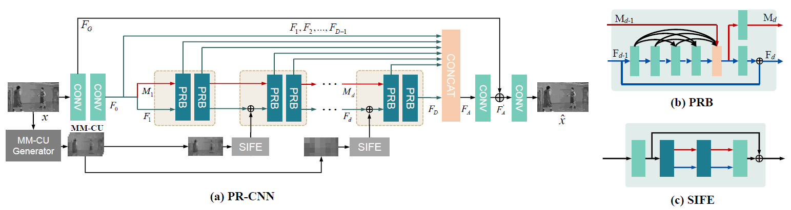
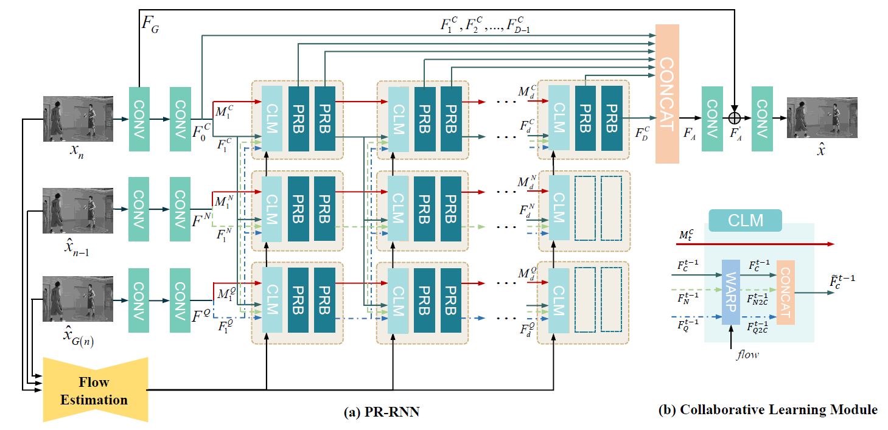
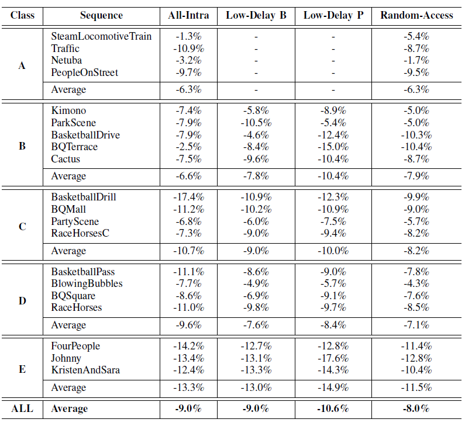

<b>Combining Progressive Rethinking and Collaborative Learning: A Deep Framework for In-Loop Filtering </b> [[PDF]](https://arxiv.org/abs/2001.05651)

[Dezhao Wang](https://dezhao-wang.github.io/), [Sifeng Xia](https://pigundermoon.github.io/), [Wenhan Yang](https://flyywh.github.io/), [Jiaying Liu](http://39.96.165.147/people/liujiaying.html)

### Abstract

In this paper, we aim to address two critical issues in deep-learning based in-loop filter of modern codecs: 1) how to model spatial and temporal redundancies more effectively in the coding scenario; 2) what kinds of side information (side-info) can be inferred from the codecs to benefit in-loop filter models and how this side-info is injected. For the first issue, we design a deep network with both progressive rethinking and collaborative learning mechanisms to improve quality of the reconstructed intra-frames and inter-frames, respectively. For intra coding, a Progressive Rethinking Block (PRB) and its stacked Progressive Rethinking Network (PRN) are designed to simulate the human decision mechanism for effective spatial modeling. The typical cascaded deep network utilizes a bottleneck module at the end of each block to reduce the dimension size of the feature to generate the summarization of past experiences. Our designed block rethinks progressively, namely introducing an additional inter-block connection to bypass a high-dimensional informative feature across blocks to review the complete past memorized experiences. For inter coding, the model learns collaboratively for temporal modeling. The current reconstructed frame interacts with reference frames (peak quality frame and the nearest adjacent frame) progressively at the feature level. For the second issue, side-info utilization, we extract both intra-frame and interframe side-info for a better context modeling. A coarse-to-fine partition map based on HEVC partition trees is built as the intra-frame side-info. Furthermore, the warped features of the reference frames are offered as the inter-frame side-info. Benefiting from our subtle design, under All-Intra (AI), Low-Delay B (LDB), Low-Delay P (LDP) and Random Access (RA) configuration, our PRNs provide 9.0%, 9.0%, 10.6% and 8.0% BD-rate reduction on average respectively.

### Framework

##### Progressive Rethinking Convolutional Neural Network

*Fig 1. (a) The architecture of the Progressive Rethinking Convolutional Neural Network. The network takes the unfiltered frame as the input and it generates the filtered output frame. The feature maps extracted from the side-info by SIFE are added to data flow during the processing. (b) The structure of Progressive Rethinking Block. (c) The architecture of Side Information Feature Extractor.*

##### Progressive Rethinking Recurrent Neural Network

*Fig 2. (a) The architecture of the Progressive Rethinking Recurrent Neural Network under LD configuration. (b) The structure of Collaborative Learning Module.*

### Results

### Citation

@misc{wang2020combining, 
  author={D. {Wang} and S. {Xia} and W. {Yang} and J. {Liu}},
  journal={IEEE Transactions on Image Processing}, 
  title={Combining Progressive Rethinking and Collaborative Learning: A Deep Framework for In-Loop Filtering}, 
  year={2021},
  volume={},
  number={},
  pages={1-1},
  doi={10.1109/TIP.2021.3068638}
}

